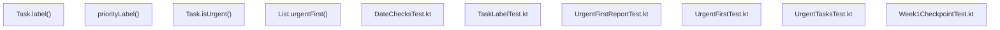

# Urgent-task code map

```mermaid
flowchart TD
    %% Urgent-task functions
    LABEL["Task.label()"]
    PRIORITY["priorityLabel()"]
    ISURGENT["Task.isUrgent()"]
    URGENTFIRST["List<Task>.urgentFirst()"]

    %% Test files
    DATECHECKS["DateChecksTest.kt"]
    TASKLABEL["TaskLabelTest.kt"]
    REPORTTEST["UrgentFirstReportTest.kt"]
    FIRSTTEST["UrgentFirstTest.kt"]
    URGENTTESTS["UrgentTasksTest.kt"]
    CHECKPOINT["Week1CheckpointTest.kt"]
```

## Arrow evidence

| Arrow | File:line |
|---|---|
| | |
| | |
| | |
| | |
| | |

